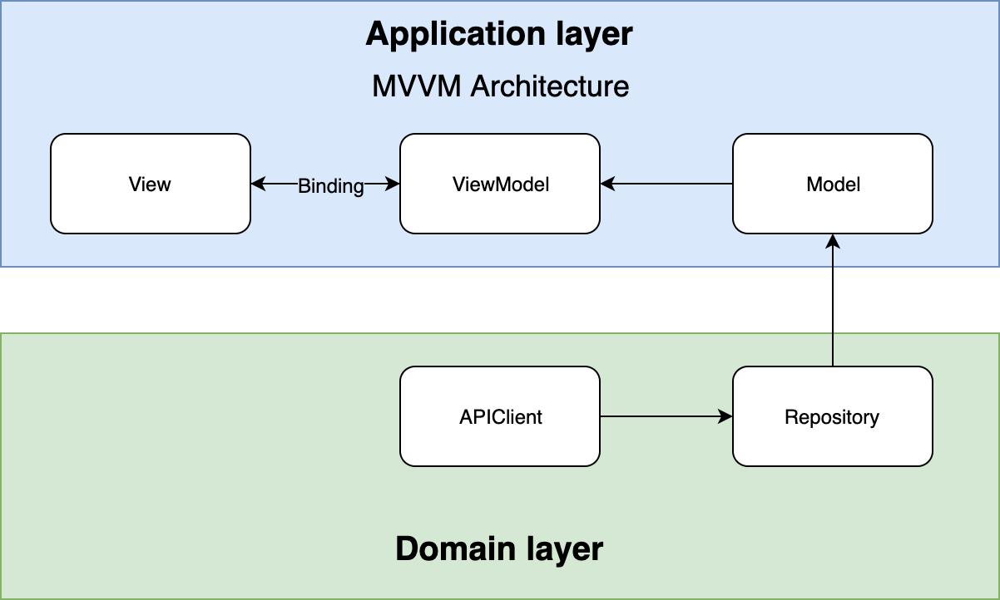
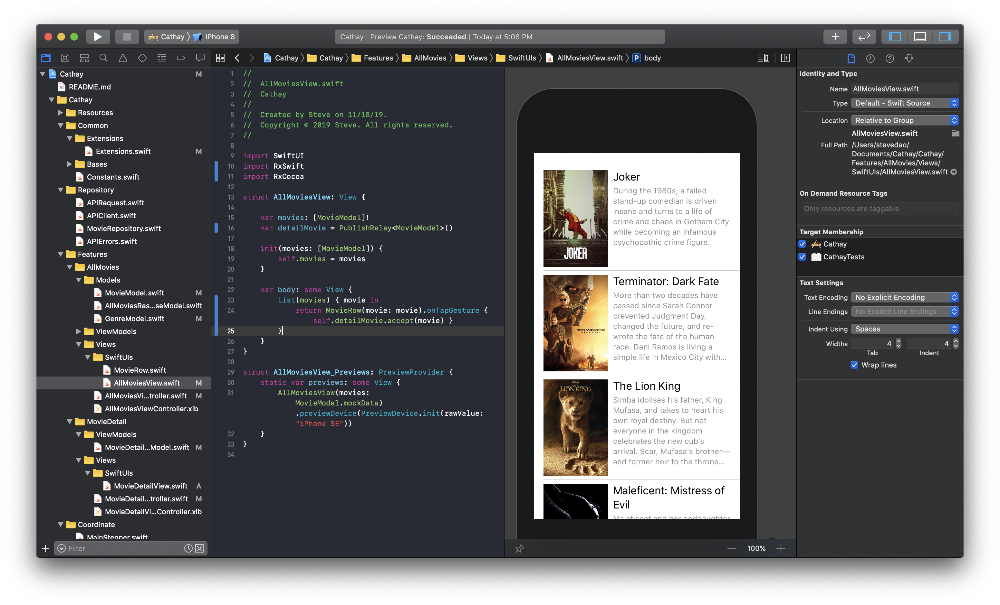

# Cathay


## Hello world!
Cathay is an iOS assignment while applying to **ShopBack** at Singapore.

We're applying some keys:
1. MVVM architecture.
2. Reactive programming by RxSwift & RxCocoa.
3. Applying Coordinator pattern by RxFlow for App's navigations.
4. Implementing UI by SwiftUI.
5. Carthage dependency manager.


Feel free to contribute to make this open-source project become better for everyone who love reactive programming & MVVM architecture.

## Checklists
- [x] Building the base project by MVVM architecture.
- [x] Adding the Carthage dependency manager & all needed dependencies.
- [x] Implementing all needed ViewModels.
- [x] Writing Unit Tests for ViewModels.
- [x] Implementing repository.
- [x] Adding the Mock datas & mock services.
- [x] Implementing the Coordinator by RxFlow.
- [x] Implementing Views by SwiftUI.
- [ ] Implementing repository by real API services from TheMovieDB.
- [ ] Supporting an entry point from deep link by RxFlow.
- [ ] Supporting multi schemes for mock & real services.
- [ ] Using Swinject/SwinjectStoryboard for depenencies injection.

## Installation
We're using the [**Carthage**](https://github.com/Carthage/Carthage) dependency manager instead of **Cocoapods** to speed up the build time. </br>
We've written a script to let you get started easier. Please go to the root folder of project then run this script at terminal:
```
$ sh ./setup.sh
```
Now, take a cup of coffee! Sometime the terminal may ask you something to finish the process, feel free to take a look.

## Architectures
We separate main Application to 2 main components: Application & Domain


### Application layer:
Where we're applying the **MVVM** architecture to isolate the main business logics from other resources.

### Domain layer:
Where we're implementing the dependency for resource requests such as: repository, caching, etc. In this demonstration project, we only implement the Repository here.

### Navigation:
Apple has introduced **StoryBoard** & **Segue** to navigate between screens. It's suitable for small App by **MVC** architecture. It's a strong recommendation to apply the **Coordinator** idea to **MVVM** architecture by reactive programming. We're using the [**RxFlow**](https://github.com/RxSwiftCommunity/RxFlow) to manage the navigation.

### SwiftUI:
We're applying the **SwiftUI** to implement the UI for all screens.


## License

MIT License

Copyright (c) 2019 Steve

Permission is hereby granted, free of charge, to any person obtaining a copy
of this software and associated documentation files (the "Software"), to deal
in the Software without restriction, including without limitation the rights
to use, copy, modify, merge, publish, distribute, sublicense, and/or sell
copies of the Software, and to permit persons to whom the Software is
furnished to do so, subject to the following conditions:

The above copyright notice and this permission notice shall be included in all
copies or substantial portions of the Software.

THE SOFTWARE IS PROVIDED "AS IS", WITHOUT WARRANTY OF ANY KIND, EXPRESS OR
IMPLIED, INCLUDING BUT NOT LIMITED TO THE WARRANTIES OF MERCHANTABILITY,
FITNESS FOR A PARTICULAR PURPOSE AND NONINFRINGEMENT. IN NO EVENT SHALL THE
AUTHORS OR COPYRIGHT HOLDERS BE LIABLE FOR ANY CLAIM, DAMAGES OR OTHER
LIABILITY, WHETHER IN AN ACTION OF CONTRACT, TORT OR OTHERWISE, ARISING FROM,
OUT OF OR IN CONNECTION WITH THE SOFTWARE OR THE USE OR OTHER DEALINGS IN THE
SOFTWARE.
